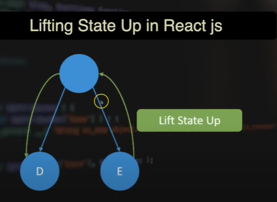
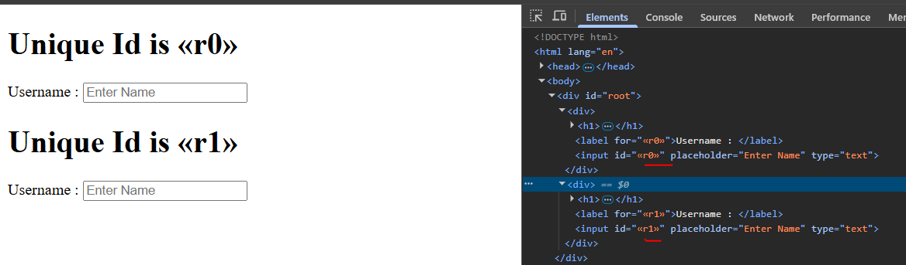
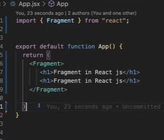
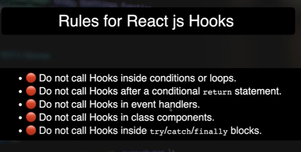
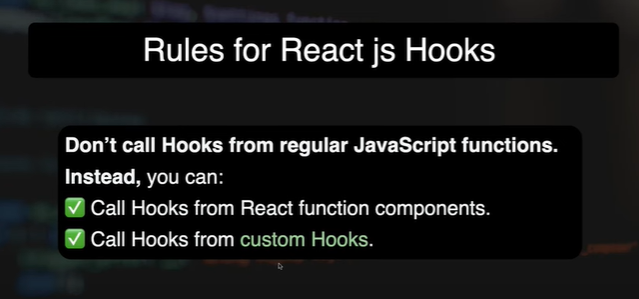

# React + Vite

This template provides a minimal setup to get React working in Vite with HMR and some ESLint rules.

Currently, two official plugins are available:

- [@vitejs/plugin-react](https://github.com/vitejs/vite-plugin-react/blob/main/packages/plugin-react) uses [Babel](https://babeljs.io/) for Fast Refresh
- [@vitejs/plugin-react-swc](https://github.com/vitejs/vite-plugin-react/blob/main/packages/plugin-react-swc) uses [SWC](https://swc.rs/) for Fast Refresh

## Expanding the ESLint configuration

If you are developing a production application, we recommend using TypeScript with type-aware lint rules enabled. Check out the [TS template](https://github.com/vitejs/vite/tree/main/packages/create-vite/template-react-ts) for information on how to integrate TypeScript and [`typescript-eslint`](https://typescript-eslint.io) in your project.

## Styled Component

use command : npm i styled-components to install the style component.
It is a npm package , that we directly use for styling.
Link : https://styled-components.com/docs/basics

## Style module 

If you want to create a css file only for specific component , then you use Style module. Ex: userProfile.module.css

## React Bootstrap

Go to react bootstrap website and install bootstrap from there.
Link : https://react-bootstrap.netlify.app/

# Hooks 

## UseRef

useRef, like the name suggests, lets you create a reference to a value. This reference is in the form of an object, called a ref object. The ref object has a current property that stores the value. The ref object is mutable; you can change its current property and read it.

Difference between state and ref : 
A ref is similar to state, in that, we can hold and mutate values to be used in a component. However, unlike state, mutation of a ref does not trigger a re-render. This makes useRef suitable for storing mutable values that need to persist across renders without causing the component to re-render.

## Forward Ref 

in v18 and before , we use ForwardRef but in v19 forwardRef is deprecated.
we use it to pass the ref from parent to child component.

## useFormStatus vs useTransition

To check the status of the form or to add loader .  
In useFormStatus : we must have form tag there else it will not work.
In useTransition : It can work without form tag. like on button .

## some rules in react

what is pure function ?
what is pure component ?

## lifting state up in react

## useActionState

Used in forms

## useId 

To generate Unique Id's

Do not use useId in a key while generating list .

## Fragment 

Using fragement it does not create a new element like div in DOM .

## Rules of hooks in react 

